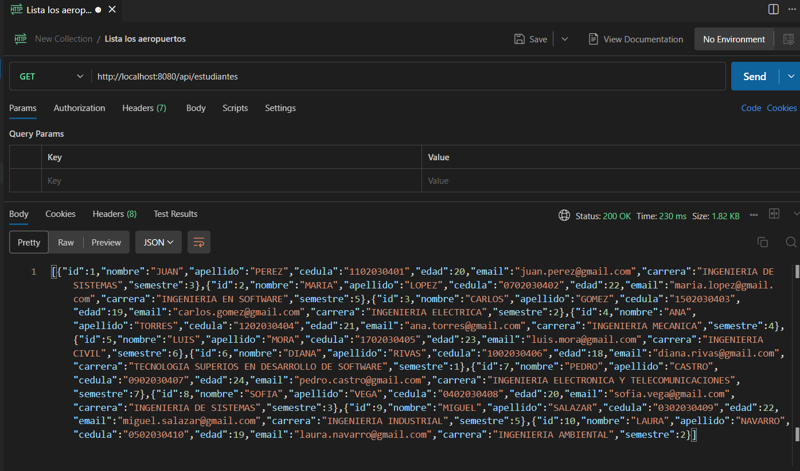
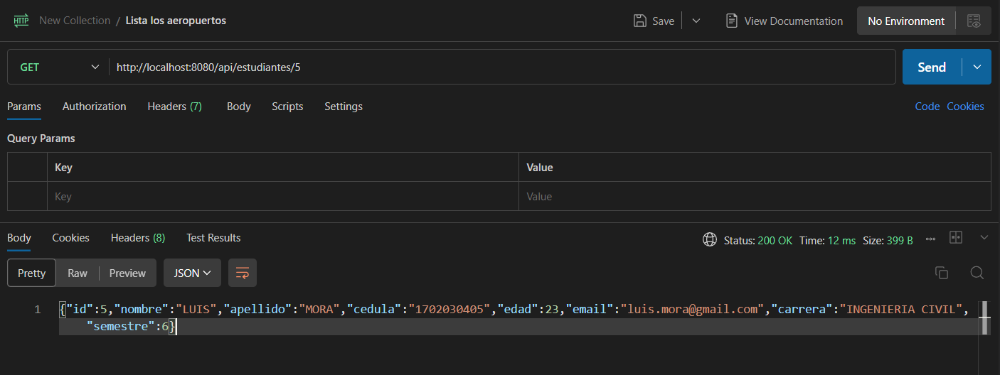
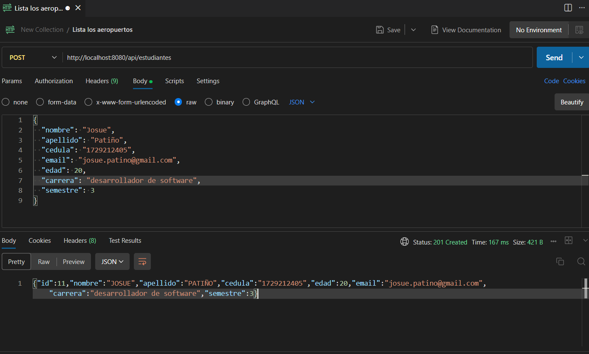
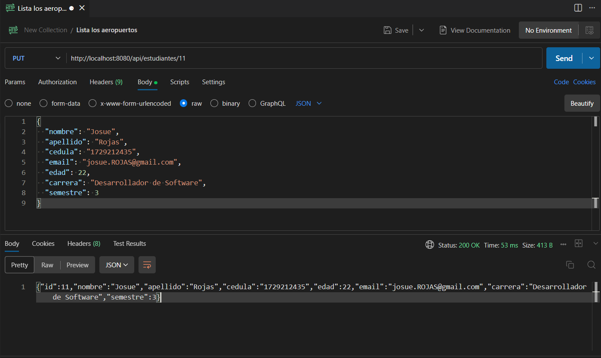
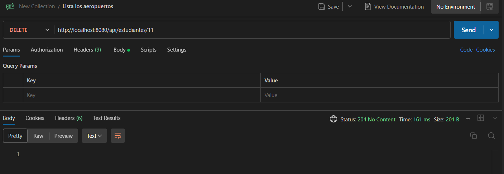
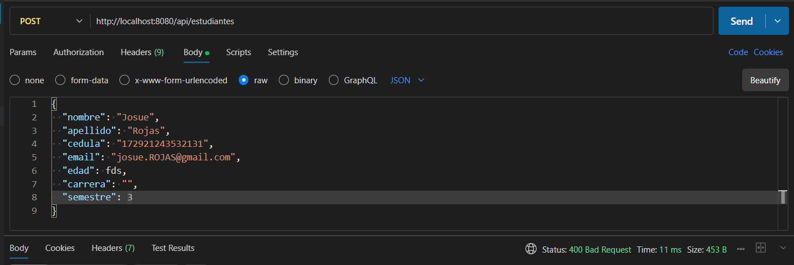
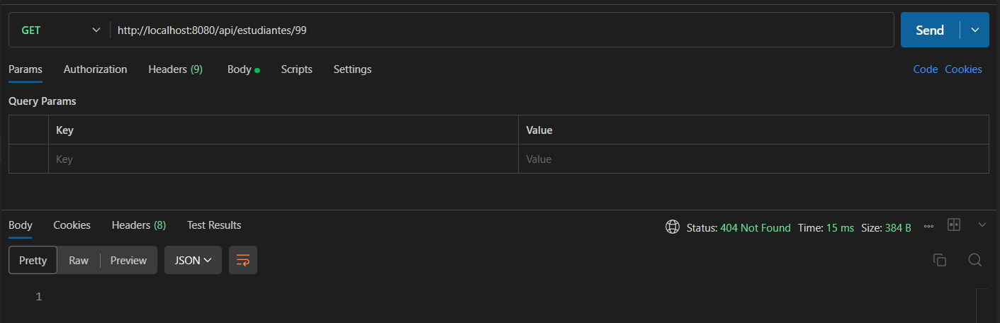
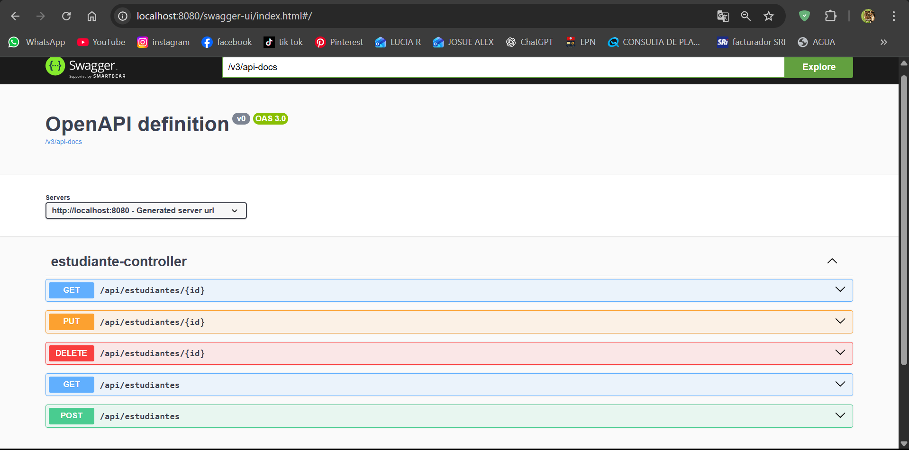

# DOCUMENTO DE PRUEBAS – API REST GESTIÓN DE ESTUDIANTES

**Asignatura:** Desarrollo Backend con Spring Boot
**Proyecto:** API REST – Gestión de Estudiantes
**Estudiante(s):**

* Josue Patiño
* Concepción Arequipa
---

## 1. Introducción

El presente documento tiene como objetivo evidenciar el correcto funcionamiento de la **API REST de Gestión de Estudiantes**, mediante pruebas realizadas a cada uno de los endpoints CRUD utilizando **Postman** y/o **Swagger**.

Cada prueba muestra la solicitud realizada, los datos enviados y la respuesta obtenida por la API.

---

## 2. Pruebas de Endpoints

---

### 2.1 Listar todos los estudiantes

**Método:** GET
**Endpoint:**

```
/api/estudiantes
```

**Descripción:**
Este endpoint permite obtener la lista completa de estudiantes registrados en la base de datos.

**Evidencia:**

**

---

### 2.2 Obtener estudiante por ID

**Método:** GET
**Endpoint:**

```
/api/estudiantes/{id}
```

**Descripción:**
Permite obtener la información de un estudiante específico a partir de su ID.

 **Evidencia:**

**

---

### 2.3 Crear un nuevo estudiante

**Método:** POST
**Endpoint:**

```
/api/estudiantes
```

**Body (JSON):**

```json
{
  "nombre": "Juan",
  "apellido": "Perez",
  "cedula": "1102030401",
  "email": "juan.perez@mail.com",
  "edad": 20,
  "carrera": "Ingeniería de Sistemas",
  "semestre": 3
}
```

**Descripción:**
Este endpoint permite registrar un nuevo estudiante en el sistema.

**Evidencia:**

**

---

### 2.4 Actualizar un estudiante

**Método:** PUT
**Endpoint:**

```
/api/estudiantes/{id}
```

**Descripción:**
Permite actualizar la información de un estudiante existente.

**Evidencia:**

**

---

### 2.5 Eliminar un estudiante

**Método:** DELETE
**Endpoint:**

```
/api/estudiantes/{id}
```

**Descripción:**
Este endpoint elimina un estudiante del sistema según su ID.

📸 **Evidencia:**
**

---

## 3. Pruebas de Validaciones y Errores

---

### 3.1 Error por datos inválidos (400 Bad Request)

**Descripción:**
Se prueba el envío de datos inválidos, por ejemplo campos vacíos o con formato incorrecto.

**Evidencia:**

**

---

## 3.2 Recurso no encontrado (404 Not Found)

**Descripción:**
Se intenta obtener un estudiante con un ID inexistente.

 **Evidencia:**
**

---
## 4. Uso de Swagger

Usando la libreria de Swagger en nuestro pom.xml pudimos consumir los endpoints de una mejor.

**Evidencia:**

**

---

## 5. Conclusiones

Las pruebas realizadas demuestran que la API cumple correctamente con las operaciones CRUD, valida los datos de entrada y maneja errores de forma adecuada, devolviendo respuestas claras y códigos HTTP correctos.

---

## 6. Herramientas Utilizadas

* Postman
* Swagger OpenAPI
* Spring Boot
* MySQL

---
